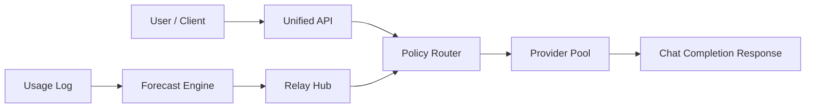

# Architecture

AI Capacity Optimizer is organized around five layers.

## 1. Observation

Usage events are stored in `aco/data/usage_log.json` and loaded through `aco.backend.usage_tracker`.

## 2. Forecasting

`aco.engine.forecast_engine` predicts month-end usage with:

- exponential moving average for recent baseline usage
- short-window linear trend for momentum
- remaining cycle days for month-end projection

## 3. Decisioning

`aco.engine.idle_detection`, `aco.engine.value_estimator`, and `aco.backend.optimizer` convert forecasts into:

- idle level
- usage risk
- estimated wasted value
- optimization suggestions
- task injection simulation

## 4. Relay Hub

`aco.backend.relay_hub` is the internal middle station. It receives internal requests, ranks them by priority and deadline, and allocates predicted idle tokens.

## 5. Unified API

`aco.backend.api_gateway` hides multiple provider/model pools behind one endpoint. It scores providers by:

- quality
- remaining capacity
- cost
- latency

`aco.api_server` exposes a small stdlib HTTP server with OpenAI-compatible-ish chat completion responses.

## Request Flow

