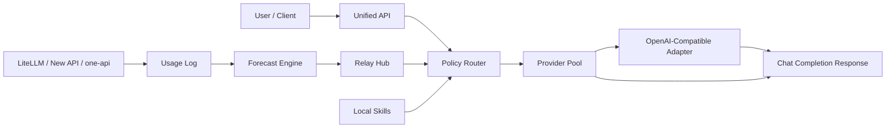

# Architecture

AI Capacity Optimizer is organized around six layers.

## 1. Observation

Usage events are stored in `aco/data/usage_log.json` and loaded through `aco.backend.usage_tracker`.

## 2. Forecasting

`aco.engine.forecast_engine` predicts month-end usage with:

- exponential moving average for recent baseline usage
- short-window linear trend for momentum
- remaining cycle days for month-end projection

## 3. Decisioning

`aco.engine.idle_detection`, `aco.engine.value_estimator`, and `aco.backend.optimizer` convert forecasts into:

- idle level
- usage risk
- estimated wasted value
- optimization suggestions
- task injection simulation

## 4. Relay Hub

`aco.backend.relay_hub` is the internal middle station. It receives internal requests, ranks them by priority and deadline, and allocates predicted idle tokens.

## 5. Gateway Compatibility

`aco.backend.api_gateway` provides a local compatibility surface for demos and experiments. Production gateway execution should usually live in LiteLLM, New API, or one-api, while ACO consumes their usage, quota, budget, and spend data.

The local compatibility router scores provider pools by:

- quality
- remaining capacity
- cost
- latency

`aco.api_server` exposes a small stdlib HTTP server with OpenAI-compatible-ish chat completion responses for local testing.

Live mode uses `aco.backend.openai_compatible` to forward non-streaming chat completions to OpenAI-compatible providers. `aco.backend.accounting` records each provider attempt in `request_log.json` and successful usage in `usage_log.json`.

## 6. Skills

`aco.skills` discovers local skills from the repository `skills/` directory. The initial runtime supports `routing_policy` skills that can reorder provider candidates for policies such as `cheap` and `fill_idle`.

## Request Flow

